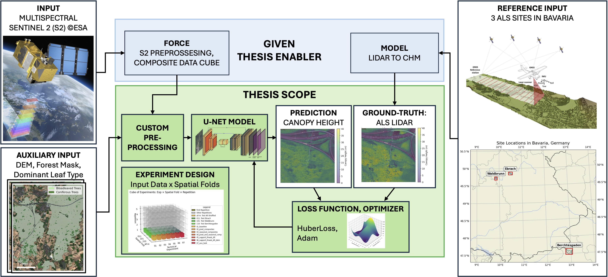
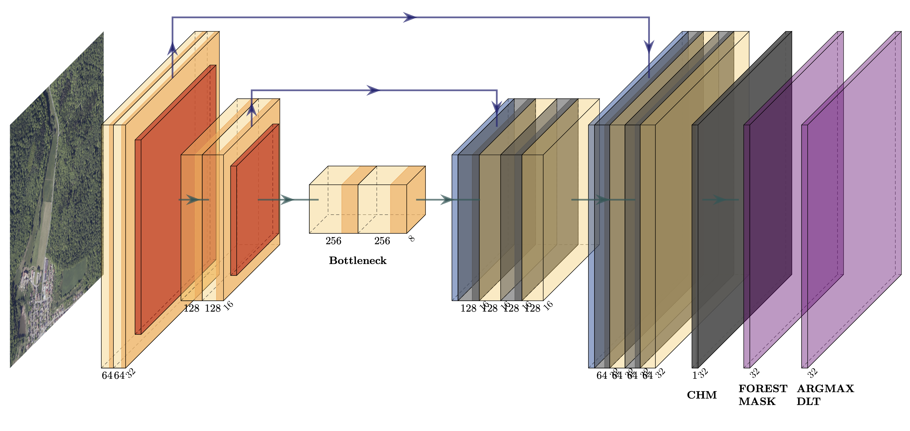
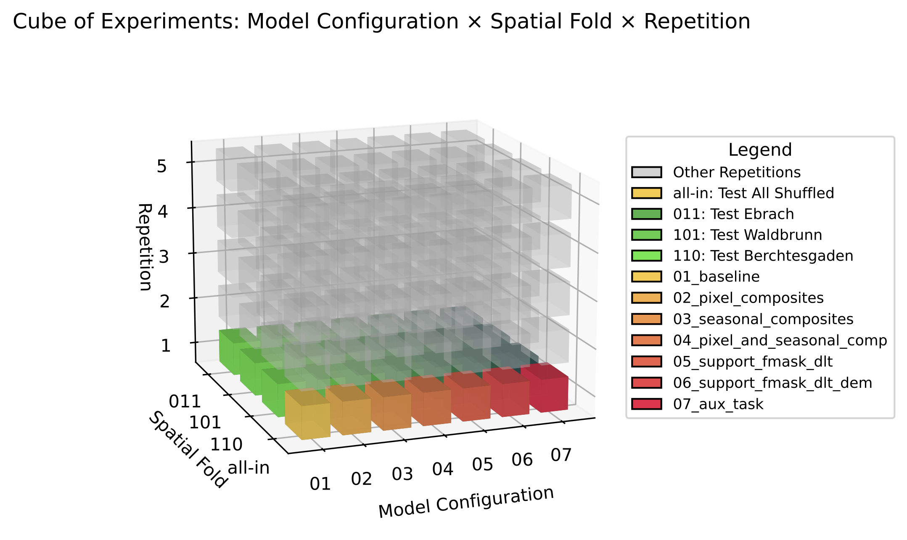
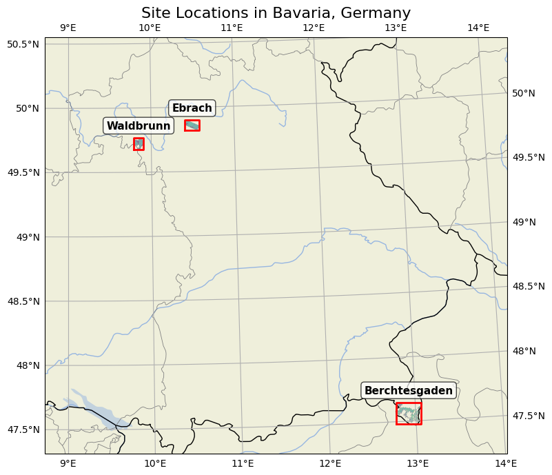

# TreeHeads

**Forest Canopy Height Estimation from Multi-Spectral Satellite Imagery**

A Convolutional Learning Framework with Airborne Laser Scanning Supervision

A Master's thesis project implementing a deep learning framework for estimating canopy height models (CHM) from Sentinel-2 satellite imagery, validated against airborne LiDAR (ALS) reference data across three forest study sites in Bavaria, Germany.

TreeHeads uses a custom U-Net architecture trained on multi-temporal spectral composites with spatial cross-validation to assess generalization performance across independent test sites.

## Quick Start

```bash
# 1. Clone the repository
git clone git@github.com:fizz-x/TreeHeads.git
cd TreeHeads

# 2. Install dependencies
pip install -r requirements.txt

# 3. Follow the reproducibility workflow below
```

## Architecture & Experimental Setup

### Model Architecture



**U-Net with Multi-Task Outputs:**
- **Encoder**: 2 convolutional blocks + max pooling (32×32 → 8×8)
- **Bottleneck**: 256 channels at lowest resolution
- **Decoder**: 2 upsampling blocks with skip connections (back to 32×32)
- **Output Heads**: Multi-task outputs for CHM (primary), forest mask (FMASK), and leaf type (DLT)

<div align="center" style="width: 75%;">



</div>

### Experimental Design

<div align="center" style="width: 75%;">



</div>

The project evaluates **7 model configurations** across **3 spatial cross-validation folds** with **5 random repetitions**:

- **Model Configurations**: Baseline → progressive addition of spectral composites, auxiliary inputs, and auxiliary tasks
- **Spatial Folds**: Leave-one-site-out cross-validation (Ebrach, Waldbrunn, Berchtesgaden)
- **Repetitions**: 5 runs with different random seeds for robustness assessment

## Folder Structure

```
TreeHeads/
├── data/                          # Large files (not tracked by git)
│   ├── 00_input_raw/              # Raw Sentinel-2 & ALS data from FORCE pipeline
│   │   └── S2_SEASONS/            # Sentinel-2 seasonal composites
│   ├── 01_input_pipeline/         # Site-specific preprocessed data
│   │   ├── 01_Ebrach/
│   │   ├── 02_Waldbrunn/
│   │   └── 03_Berchtesgaden/
│   ├── 02_processed/              # Resampled & aligned rasters (S2, ALS, aux layers)
│   ├── 03_training/               # Stacked training patches (.npy)
│   ├── 04_orthophoto/             # Reference orthophotos for visualization
│   │   ├── ebrach/
│   │   ├── waldbrunn/
│   │   └── berchtesgaden/
│   └── 10_insights/               # Generated figures & analysis plots
├── configs/                       # Configuration files
│   ├── experiments.yaml           # 7 experiment definitions
│   ├── normparams.yaml            # Feature normalization parameters per site combo
│   └── datapaths_INF.yaml         # Inference site paths
├── processing/                    # Data preparation notebooks
│   ├── 01_init.ipynb              # Download, preprocess, align S2 & ALS
│   ├── 02_normalization.ipynb     # Compute normalization statistics
│   ├── 03_data_insights.ipynb     # Exploratory data analysis
│   ├── 04_check_datastack_sizes.ipynb  # Analyze training dataset sizes
│   └── 05_config_viz.ipynb        # Visualize experiment matrix & spatial folds
├── src/                           # Training, inference & evaluation
│   ├── run_main.ipynb             # Main training pipeline (all-in setup)
│   ├── run_inference.ipynb        # Generate predictions & maps on inference sites
│   ├── run_eval.ipynb             # Evaluation metrics & visualizations
│   ├── run_eval_generalization.ipynb  # Generalization analysis across folds
│   └── run_main_generalization.ipynb  # Spatial cross-validation training
├── utils/                         # Core utility modules
│   ├── model_loader.py            # U-Net model, training, data loading
│   ├── data_loader.py             # Data preparation & patch extraction
│   ├── config_loader.py           # Configuration management
│   ├── eval_pipe.py               # Evaluation metrics & plotting
│   ├── plotting.py                # Visualization utilities
│   ├── processing.py              # Geospatial processing
│   └── basics.py                  # Basic I/O & raster operations
├── results/                       # Trained models & results (not tracked by git)
│   └── {run_id}/
│       ├── train/                 # Training checkpoints, logs, predictions
│       │   └── {experiment_name}/
│       │       ├── model_weights.pth
│       │       ├── logs.json
│       │       ├── cfg.json
│       │       └── val_preds_targets.npz
│       └── inference/             # Inference outputs & maps
│           └── {experiment_name}/
│               ├── {site}_pred.tif
│               ├── {site}_gt.tif
│               ├── OVL_{site}_{orthophoto_id}.pdf
│               └── folium/folium_map_{site}.html
├── graphics/                      # Project figures & visualizations
├── requirements.txt
└── README.md
```

**Note:** The `data/`, `results/` directories are excluded from version control (`.gitignore`) to avoid pushing large files.

## Reproducibility Workflow

### Step 1: Data Preparation

**Objective**: Preprocess raw Sentinel-2 and ALS data, align to common grid, compute normalization.

```bash
# 1a. Prepare raw data
# - Download Sentinel-2 FORCE L2A products to: data/00_input_raw/S2_SEASONS/
# - Download airborne LiDAR (ALS) CHM to: data/01_input_pipeline/{site_name}/
# - Provide auxiliary layers (DEM, FMASK, DLT) in same locations

# 1b. Run preprocessing
jupyter notebook processing/01_init.ipynb
```

**Expected outputs:**
- Aligned S2 stacks: `data/02_processed/{site}/S2/{season}/`
- Resampled ALS/DEM/FMASK/DLT: `data/02_processed/{site}/`
- Stacked training patches: `data/03_training/{site}_{combo}.npy`

**Configuration:**
- Edit `configs/datapaths.yaml` with your site paths
- Adjust normalization settings in `configs/normparams.yaml`

```bash
# 1c. Compute normalization statistics
jupyter notebook processing/02_normalization.ipynb

# 1d. Explore data
jupyter notebook processing/03_data_insights.ipynb
jupyter notebook processing/04_check_datastack_sizes.ipynb
```

### Step 2: Configuration

Define your experiments in `configs/experiments.yaml`. Example:

```yaml
03_seasonal_composites:
  spectral:
    seasons: ["spring", "summer", "autumn"]
    quantiles: ["Q50"]
  aux_inputs: ["FMASK"]
  strategy: "all_in_model"
  outputs:
    canopy_height:
      target: "CHM_norm"
      out_channels: 1
      loss: "huber"
      weight: 1.0

07_aux_task:
  spectral:
    seasons: ["spring", "summer", "autumn"]
    quantiles: ["Q25", "Q50", "Q75"]
  aux_inputs: []
  strategy: "aux_task"
  outputs:
    canopy_height:
      target: "CHM_norm"
      out_channels: 1
      loss: "huber"
      weight: 1.0
    tree_cover:
      target: "FMASK"
      out_channels: 1
      loss: "bce"
      weight: 0.3
    leaf_type:
      target: "DLT"
      out_channels: 3
      loss: "crossentropy"
      weight: 0.2
```

### Step 3: Model Training

Train the U-Net on your data with optional spatial cross-validation.

#### Option A: All-In Training (All sites as training data)

```bash
jupyter notebook src/run_main.ipynb
```

**What it does:**
- Trains on all 3 sites (shuffled together)
- Evaluates on 15% held-out test split
- Saves checkpoints to `results/{run_id}/train/{experiment_name}/`

#### Option B: Spatial Cross-Validation (Generalization assessment)

```bash
jupyter notebook src/run_main_generalization.ipynb
```

**What it does:**
- Trains on 2 sites, tests on 1 site (repeated 3 times)
- 5 random repetitions per fold
- Evaluates generalization to unseen sites
- Saves results to `results/{run_id}__{fold}_{rep}/train/`

**Config:**
- Specify `run_id_base`, `repetitions`, and `combos` in the notebook
- Configure experiments in `configs/experiments.yaml`

### Step 4: Evaluation & Analysis

Compute metrics and visualizations for trained models.

```bash
# All-in evaluation
jupyter notebook src/run_eval.ipynb
```

**Outputs:**
- Metrics table: `results/{run_id}/metrics/results_summary.csv`
- Loss curves, heatmaps, error plots: `results/{run_id}/plots/`
- Site-wise metrics: `results/{run_id}/metrics/sitewise_metrics_summary.csv`

```bash
# Generalization evaluation (spatial cross-validation)
jupyter notebook src/run_eval_generalization.ipynb
```

**Outputs:**
- Generalization scores per fold
- Comparison with all-in baseline
- Spatial generalization analysis plots

### Step 5: Inference & Visualization

Generate predictions and create interactive maps on new sites.

```bash
jupyter notebook src/run_inference.ipynb
```

**Configuration:**
- Set `run_id` and `experiment_name` to desired trained model
- Update `configs/datapaths_INF.yaml` with inference site paths
- Place orthophotos in `data/04_orthophoto/{site_name}/`

**Outputs:**
- Prediction GeoTIFFs: `results/{run_id}/inference/{exp_name}/{site}_pred.tif`
- Orthophoto overlays (PDF): `results/{run_id}/inference/{exp_name}/OVL_{site}.pdf`
- Interactive maps (HTML): `results/{run_id}/inference/{exp_name}/folium/folium_map_{site}.html`

**Example:**
```python
run_id = "251102_ALLIN_0"
exp_name = "04_pixel_and_seasonal_comp"
# Notebook generates:
# - CHM predictions
# - Error maps
# - Folium web maps with orthophoto overlays
```

## Results

Example predictions on test sites:


**Performance Summary (All-In Setup):**

| Experiment | MAE [m] | RMSE [m] | R² [-] |
|---|---|---|---|
| 01_baseline | 2.85 | 3.92 | 0.92 |
| 04_pixel_and_seasonal | 2.41 | 3.31 | 0.94 |
| 07_aux_task | 2.38 | 3.28 | 0.94 |

See `results/{run_id}/metrics/results_summary.csv` for complete results across all experiments.

## Study Sites

**Three forest test sites in Bavaria, Germany:**



## Requirements

- Python 3.8+
- PyTorch 2.0+
- GDAL/Rasterio for geospatial I/O
- See `requirements.txt` for full dependencies

```bash
pip install -r requirements.txt
```

## References & Data Sources

- **Sentinel-2**: ESA Copernicus program
- **Airborne LiDAR**: German state forest inventories
- **FORCE**: Framework for Operational Radiometric Correction for Environmental monitoring ([Frantz et al., 2019](https://www.mdpi.com/2072-4292/11/9/1124))

## Citation

If you use TreeHeads in your research, please cite:

```bibtex
@mastersthesis{treeheads2025,
  title={Forest Canopy Height Estimation from
        Multi-Spectral Satellite Imagery
        A Convolutional Learning Framework with Airborne Laser
        Scanning Supervision},
  author={Felix, Schnippering},
  school={Technical University of Munich (TUM)},
  year={2025}
}
```

## License

This project is licensed under the MIT License—see `LICENSE` file for details.

## Contact

For questions or issues, open a GitHub issue or hit me up.
Felix.Schnippering@tum.de

---

**Enjoy mapping canopy height!** 🌲📡